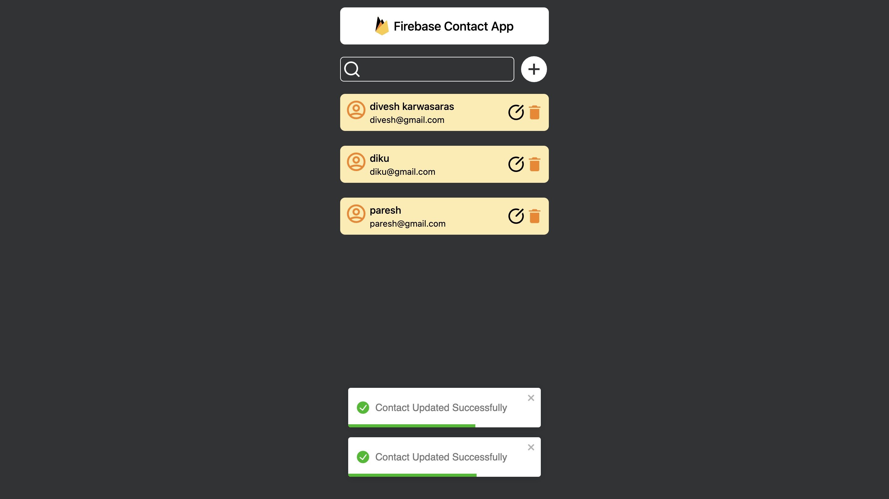

# 🚀 Contact Saver 📇✨

Welcome to **Contact Saver**, a powerful React app designed to help you easily save, update, delete, and search contacts. This project uses Firebase’s real-time database to securely manage contact information, ensuring data is always up-to-date and accessible.

---

  
*Screenshot of the Contact Saver app interface.*

## About the Project
**Contact Saver** was developed as part of the "10 Days, 10 Projects" challenge. This app was a fantastic opportunity to explore CRUD (Create, Read, Update, Delete) operations in a React application while integrating Firebase as a backend solution for real-time data management.

## Features
- **Add Contacts:** Save new contacts with relevant details.
- **Update Contacts:** Modify existing contact details easily.
- **Delete Contacts:** Remove contacts as needed.
- **Search Contacts:** Quickly find contacts with a search functionality.
- **Firebase Integration:** Data is stored and managed in Firebase’s real-time database.
- **React State Management:** Efficient state handling for dynamic and responsive interactions.

## Getting Started
To get a local copy up and running, follow these steps.

### Prerequisites
- **Node.js** (v12 or higher)
- **Firebase Account**: Sign up at [Firebase](https://firebase.google.com/).

### Installation

1. **Clone the Repository**
   ```bash
   git clone https://github.com/pareshsutharr/10_React_projects.git
   cd 10_React_projects/project-5
